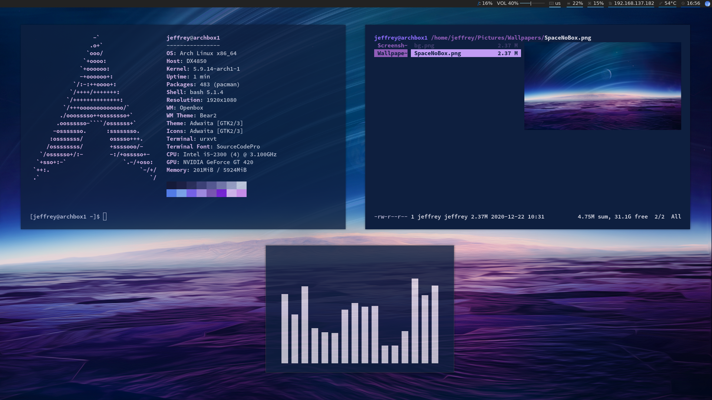

# dotfiles
Configuration files for window manager and other software on my system.

# Example Instructions
1. archinstall
2. install git
3. clone this repo, cd Scripts
4. chmod +x install.sh
5. yes | ./install.sh
